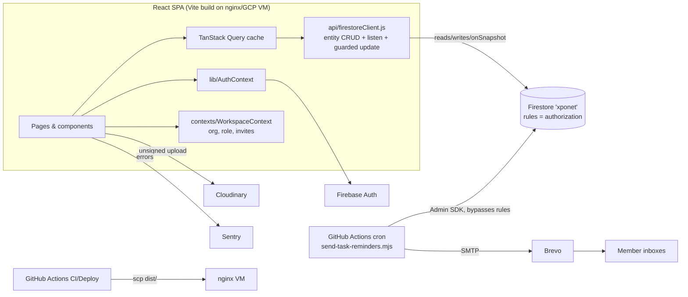

# Xponet — Codebase Analysis

> Current as of commit `7251c7c` (July 13, 2026), immediately after the hardening sprint.
> Supersedes the older `ANALYSIS.md` snapshot; deployment/runbook detail lives in
> `CODEBASE_DOCUMENTATION.md`, and the pending database-consolidation proposal in
> `docs/db-consolidation-plan.md`.

Xponet is a Notion-style collaborative workspace for teams: block-based pages,
schema'd databases with multiple views, tasks (kanban/table), SLA-tracked tickets,
a command center, templates, workspace invitations with email delivery, and
three-tier RBAC (admin / supervisor / member). It is a **serverless-by-choice**
product: a static React SPA talking directly to Firestore, with GitHub Actions
standing in for a backend where secrets are involved.

---

## 1. Tech stack

| Layer | Technology | Notes |
|---|---|---|
| UI | React 19, Vite 8 (Rolldown), Tailwind CSS **v3.4**, shadcn/Radix (`radix-ui` monolith pkg), lucide icons | JSX throughout; a few `.tsx` files in `components/ui` |
| Routing | React Router v7 | Route-level `React.lazy` code splitting |
| Server state | TanStack Query v5 | Global 60s polling + window-focus refetch; live `onSnapshot` listeners on hot collections |
| Data | Cloud Firestore — **named database `xponet`, Enterprise edition** | Client SDK direct; security rules are the entire authorization layer |
| Auth | Firebase Auth (email/password + Google popup) | Single active session per browser |
| Files | Cloudinary unsigned uploads (`src/lib/cloudinary.js`) | Preset-restricted |
| Email | Firestore `mail` queue → GitHub Actions cron (`*/15`, best-effort) → Brevo SMTP | Avoids the Firebase Blaze plan entirely |
| Monitoring | Sentry (`@sentry/react`) | Wired in `main.jsx` |
| DnD / misc | `@hello-pangea/dnd` (kanban), `@tanstack/react-virtual` (tables), `cmdk` (palette), `sonner` (toasts), `recharts` (command center) | |
| Tests | Vitest (unit) + `@firebase/rules-unit-testing` (rules, in emulator) | Run in CI |
| Hosting | nginx on a GCP VM (`35.232.106.86`), `dist/` copied to `/var/www/html` | Legacy Firebase Hosting config retained but inactive |

**Scale:** ~150 source files, ~23,000 lines. Largest files: `PageEditor.jsx` (1,765),
`DocumentHub.jsx` (1,284), `Databases.jsx` (1,070), `Templates.jsx` (704).

**The defining constraint:** there is no application server. Every mutation is a
client-side Firestore write authorized only by `firestore.rules`; anything needing a
secret (SMTP, service accounts, future AI keys) runs in GitHub Actions or would run
on the VM. Several architectural decisions below flow from this.

---

## 2. Architecture



### Directory map

```
src/
├── api/
│   ├── firestoreClient.js      # makeEntity() factory: filter/get/create/update/
│   │                           #   updateGuarded (conflict-safe)/upsert/delete/listen
│   │                           #   + backlinks, row bodies, row templates, user profiles
│   └── seedDocumentHub.js      # idempotent per-org Document Hub seeding
├── components/
│   ├── ui/                     # shadcn primitives (Radix) — Tailwind v3-normalized
│   ├── layout/                 # Sidebar, WorkspaceSwitcher, CommandPalette, PageHeader
│   ├── editor/                 # BlockRenderer, SlashMenu, TableBlock, InlineRefDropdown
│   ├── database/               # CellEditor/Renderer, Table/Board/List/Gallery views,
│   │                           #   PropertyEditor, InlineDatabaseEmbed, row templates
│   ├── tasks/                  # KanbanBoard, TaskTable (virtualized grid), TaskModal
│   ├── page/                   # comments, permissions dialog, PeekPanel, backlinks
│   ├── templates/, settings/   # template pickers, audit log tab
│   └── *.jsx                   # InvitePrompt, ErrorBoundary, OfflineBanner,
│                               #   RetryIndicator, PresenceAvatars, route guards
├── contexts/                   # WorkspaceContext (org/role/invites), PeekContext
├── hooks/                      # useLiveCollection (onSnapshot→query cache),
│                               #   usePresence, use-mobile
├── lib/                        # AuthContext, permissions (RBAC + rule projections),
│                               #   query-client, firebase, cloudinary, auditLog,
│                               #   pageRouter, task-utils
├── pages/                      # 18 routes (see §4)
scripts/                        # send-task-reminders.mjs (cron mailer),
                                #   migrate-rbac-and-assignees.mjs
tests/rules/                    # Firestore security-rules suite (emulator)
.github/workflows/              # ci.yml, deploy.yml, task-reminders.yml
firestore.rules                 # the authorization layer (deployed to prod)
```

---

## 3. Data model (Firestore collections)

| Collection | Purpose | Key fields | Access (rules) |
|---|---|---|---|
| `organizations` | Workspaces | `name`, `icon`, `owner_email`, `members[]`, **`memberEmails[]`/`memberRoles{}`** (flat rule projections), `pending_invites[]` + **`pendingInviteEmails[]`/`pendingInviteRoles{}`** | Read: members + pending invitees. Update: field-level split by role (§5) |
| `pages` | Editor pages, incl. `is_database` blob DBs and templates | `title`, `icon`, `org_id`, `content` (JSON blocks string), `parent_id`, `is_shared`/`share_token`/`share_expires_at`, `permissions[]`, `outgoing_refs[]`, soft-delete flags | Org members; public read when `is_shared` & unexpired; page-perm gates on update/delete |
| `pages/{id}/backlinks/{srcId}` | "Linked from" index | source title/icon | Org membership via parent page |
| `databases` / `records` / `db_views` | Schema'd databases (the full-featured model) | `schema[]` (property defs), `properties{}` per record + optional `body` blocks, view configs | Org members (`org_id` on every doc) |
| `db_row_templates` | Reusable row templates | `database_id`, `org_id`, template payload | Org members |
| `tasks` | Tasks | `title`, `status`, `priority`, `assignee_emails[]`, `due_date`, `reminders_sent[]` | Read: admin/supervisor all; members only where assignee (queries must filter) |
| `tickets` | SLA tickets | severity, status, `sla_due_at`, activity log | Org members |
| `comments` | Page/record comments | `author_email`, `org_id` | Org members; author-only edit/delete |
| `notifications` | In-app inbox | `recipient_email`, `type`, `is_read` | Recipient-only read/update/delete |
| `reminder_configs` | Per-org reminder settings (doc id = org id) | `enabled`, `offsets_days[]`, `offsets_hours[]`, `send_hour_utc`, `eob_hour_utc` | Member read, admin write |
| `mail` | Outbound email queue | `to`, `subject`, `text`/`html`, `status: pending→sent/error` | **Create-only** for org members; drained by Actions via Admin SDK |
| `user_profiles/{uid}` | Personal pins + recents | `pinnedPages[]`, `recentPages[]` | Owner (uid) only |
| `presence/{org}/{type}/{id}/users/{uid}` | Ephemeral viewers | `displayName`, `lastSeen`, `status` | Authed read; self-write only |

Two storage conventions coexist for "databases" — the records model above **and** a
legacy JSON-blob model inside `pages` docs (`is_database: true`, used by
`pages/Databases.jsx`). Consolidation is planned (§8).

---

## 4. Application surface (routes)

| Route | Page | Notes |
|---|---|---|
| `/login`, `/register`, `/forgot-password`, `/reset-password` | Auth | Eagerly loaded; login pre-fills email on account switch |
| `/` | Home | Pinned/recent pages, quick stats |
| `/page/:pageId` | **PageEditor** | Block editor: slash menu, todos, toggles, callouts, tables, inline page-refs/mentions, comments, presence, sharing, conflict-guarded autosave |
| `/tasks` | Tasks | Kanban + virtualized table + My/Overdue/Today/Week/Team tabs; **live via onSnapshot** |
| `/tickets`, `/tickets/:id` | Tickets | SLA timers, severity/status workflow; live list |
| `/command-center` | CommandCenter | Admin/supervisor-only dashboards (recharts) |
| `/databases` | Databases (legacy blob model) | Own table/board/list UIs; migration target |
| `/database/:dbId` | DatabaseDetail (records model) | Table/board/list/gallery, filters/sorts, views, row templates; live records |
| `/document-hub(/:databaseId)` | DocumentHub | Hub-flavored records UI |
| `/inbox`, `/trash`, `/templates`, `/settings` | — | Settings: profile, workspace/members/invites, reminders, appearance |
| `/shared/:token` | SharedPage | Public read-only page view |

All non-auth routes are `React.lazy` chunks behind two `Suspense` boundaries (app
shell + `<Outlet/>`), cutting the main bundle from 1.65 MB to ~1.24 MB.

---

## 5. Security model

`firestore.rules` is the **only** enforcement layer (no server). Deployed state:

- **Identity** is `request.auth.token.email`; org membership via the flat
  `memberEmails` array, roles via the `memberRoles` map. `lib/permissions.js`
  (`buildMemberFields`/`buildInviteFields`) derives these projections so client
  writes and rules can never drift.
- **Org updates are field-level split by role** (hardened this sprint, covered by
  rules tests):
  - *Members*: cosmetic fields only — every membership-sensitive field
    (`members`, `memberEmails`, `memberRoles`, `owner_email`, all `pending*`)
    must be byte-identical. Closes the member→admin self-escalation hole.
  - *Admins*: full membership/invite management; cannot drop themselves from
    `memberEmails` or reassign `owner_email`.
  - *Supervisors*: role-map edits only (UI limits to member→supervisor); cannot
    add/remove people, change their own role, or touch invites.
  - *Invitees*: exactly one transition — remove **only themselves** from pending
    (decline), optionally adding **only themselves** to members **at the invited
    role** (accept).
- **List-query provability:** the org read rule is two separate `allow read`
  statements (member / pending invitee) because this Enterprise-edition database
  rejects mixed-field `||` disjunctions when proving list queries. Same reason
  `memberEmails`/`pendingInviteEmails` are flat arrays queried with
  `array-contains`.
- **Tasks** enforce the RBAC read split server-side (admin/supervisor see all,
  members must query with the assignee filter). Content collections
  (`tasks`/`tickets`/`records`/…) allow update/delete to **any org member** —
  finer role gating there is client-side convention, not rules-enforced (accepted
  trade-off, documented in the enhancement report).
- **Mail queue** is create-only for members with required-field validation;
  never readable from clients.
- **Public sharing:** pages readable unauthenticated only when `is_shared` and
  not past `share_expires_at`. Note: rules can check only those fields — the
  `share_token` in the URL is an obscurity layer, not a rules-verified secret.
- **Known residual risks:** a supervisor could theoretically set a third party's
  role to admin (rules can't iterate map values to forbid it); content-collection
  writes aren't role-gated. Both are conscious scope decisions.

The rules suite (`tests/rules/`) runs in CI against the emulator and covers
escalation attempts, invite acceptance/decline, mail-queue constraints, task query
provability, and presence self-write.

---

## 6. Key subsystems

### Workspace & membership (`contexts/WorkspaceContext.jsx`)
Loads the user's orgs (`memberEmails array-contains`) and pending invites
(`pendingInviteEmails array-contains`) in parallel; auto-creates a first workspace
with starter pages; seeds the Document Hub idempotently. Exposes `role`,
`switchOrg`, `createWorkspace`, `acceptInvite`/`declineInvite`. The
`WorkspaceSwitcher` (sidebar header) lists workspaces, inline invite-joins, other
known accounts (localStorage; switching re-authenticates — Firebase holds one
session), and workspace creation. `InvitePrompt` surfaces pending invites as a
dialog on sign-in.

### Invitations & email
Inviting stores a pending invite on the org (never instant membership), queues an
email in `mail`, and creates an in-app notification. The scheduled workflow
(`task-reminders.yml`, `*/15` cron — GitHub crons are best-effort and can gap for
hours) drains the queue over Brevo SMTP and marks docs `sent`/`error`. Settings
shows "Invitation sent" (resend/cancel) vs "Joined". The in-app accept path is
instant regardless of email latency.

### Page editor (`pages/PageEditor.jsx`)
Blocks are a JSON array serialized into `pages.content`. Debounced autosave goes
through `Page.updateGuarded()` — a transaction that aborts with `ConflictError`
if `updated_at` advanced since load, surfacing a "changed by someone else / Load
latest" toast instead of clobbering. Inline page-refs write a backlinks
subcollection (diffed per save); mentions notify; presence avatars show
co-viewers; audit log records significant actions.

### Data access layer (`api/firestoreClient.js`)
`makeEntity(collection)` gives every domain object a uniform API: `filter`
(equality + `arrayContains`, optional `limit`/`orderBy`), `get`, `create`/`update`
(server timestamps), `updateGuarded` (conflict-safe), `upsert`, `delete`, and
`listen` (onSnapshot with the same filter syntax). Timestamps are converted to
`Date` on read. Domain helpers (backlinks, row bodies/templates, user profiles)
live alongside.

### Realtime & freshness
Three tiers: (1) `useLiveCollection(entity, filters, queryKey)` pipes onSnapshot
results straight into the query cache — applied to tasks, sidebar pages,
notifications, tickets, and database records, with polling disabled on those
keys; (2) everything else refetches on window focus and polls at 60s while
visible; (3) a global `MutationCache.onError` toast guarantees no silent failed
write (permission denials get a distinct message).

### Reminders (`scripts/send-task-reminders.mjs`)
Hourly-and-better cron: day-offset reminders fire at the org's `send_hour_utc`;
hour-offset reminders count down to a per-org end-of-business hour
(`eob_hour_utc`, default 15:00 UTC), checked every run. `reminders_sent` markers
make sends idempotent. Same run drains the mail queue.

### UI system
shadcn/Radix components in `components/ui/`, normalized to **Tailwind v3** syntax
this sprint (the originals were generated for v4; 28 files had dead variants like
`data-open:`, `ring-3`, `outline-hidden`, `h-(--var)` — now `data-[state=open]:`
etc.). House conventions: `SelectContent` defaults to popper positioning (the
item-aligned mode silently fails without a `<SelectValue>`), dark mode via class
strategy + `next-themes`-style toggle in Settings, virtualized grids use CSS grid
with a shared column template rather than `<table>` layout.

---

## 7. Operations

| Concern | Mechanism |
|---|---|
| CI (`ci.yml`) | Push/PR: `npm install` (see note) → ESLint (**0 errors enforced**; ~200 warnings are tracked debt: dead imports, react-compiler guidance) → Vitest unit suite → Firestore rules suite under the emulator (Java 21) → production build |
| Deploy (`deploy.yml`) | Push to `main`: build → `scp` tarball to the GCP VM → publish to `/var/www/html` → nginx reload. **Requires the `DEPLOY_SSH_KEY` repo secret + its public key on the VM (pending setup)** |
| Email/reminders (`task-reminders.yml`) | `*/15` cron, secrets: `FIREBASE_SERVICE_ACCOUNT_JSON`, `SMTP_*`, `MAIL_FROM` |
| Rules deploys | `firebase deploy --only firestore:rules --project xponet-f6f56` (manual, CLI) |
| Monitoring | Sentry; `RetryIndicator`/`OfflineBanner` for client-visible degradation |
| Lockfile note | The lock is generated on Windows; npm can't fully refresh os-gated optional subtrees there, so CI intentionally uses `npm install` instead of `npm ci` |

---

## 8. Known debt & near-term roadmap

Tracked in detail in the enhancement report (artifact) and
`docs/db-consolidation-plan.md`; summarized:

1. **Three database implementations** (blob `Databases.jsx`, records
   `DatabaseDetail.jsx`, `DocumentHub.jsx`) — consolidation onto the records model
   is planned with an idempotent Admin-SDK migration script (~1,500 line
   reduction). Awaiting sign-off on the data migration.
2. **Deploy secret** — generate/authorize `DEPLOY_SSH_KEY` to activate auto-deploys.
3. **Email deliverability** — `MAIL_FROM` is a gmail.com address via Brevo (DMARC
   misalignment → spam risk); move to a verified owned domain. Cron latency is
   inherent to free GitHub scheduling.
4. **Lint debt** — ~150 dead imports + react-compiler warnings (downgraded to
   warnings, cleanup incremental).
5. **Role gating on content collections** — decide whether member-level
   delete/edit restrictions should move into rules.
6. **Later:** AI assistant (Node proxy on the VM holding the Anthropic key,
   verifying Firebase ID tokens; editor "Ask AI" first), real collaborative
   editing (Yjs) if simultaneous editing becomes core, PWA pass, page-scoped
   guest access, Tailwind v4 migration proper.

---

## 9. Scorecard (post-sprint)

| Area | Grade | Movement | One-liner |
|---|---|---|---|
| Feature completeness | **A−** | — | Remarkable breadth; database duplication still drags |
| Security model | **B+** | ▲ from C+ | Escalation closed, invite flow constrained, rules tested in CI; content-role gating still conventional |
| Reliability / UX | **B+** | ▲ from B | Conflict guard, global error toasts, live presence, realtime lists |
| Code health | **B** | ▲ from B− | Tests + CI exist now; 1,000+ line pages and three DB stacks remain |
| Performance | **B** | ▲ from B− | Route splitting + query caps; main chunk still ~1.2 MB |
| Operations | **B** | ▲ from C+ | Full CI, one-click deploys pending a single secret |

**Bottom line:** the infrastructure now roughly matches the product surface. The
biggest remaining lever is the database consolidation; the biggest differentiator
on deck is the AI assistant.
